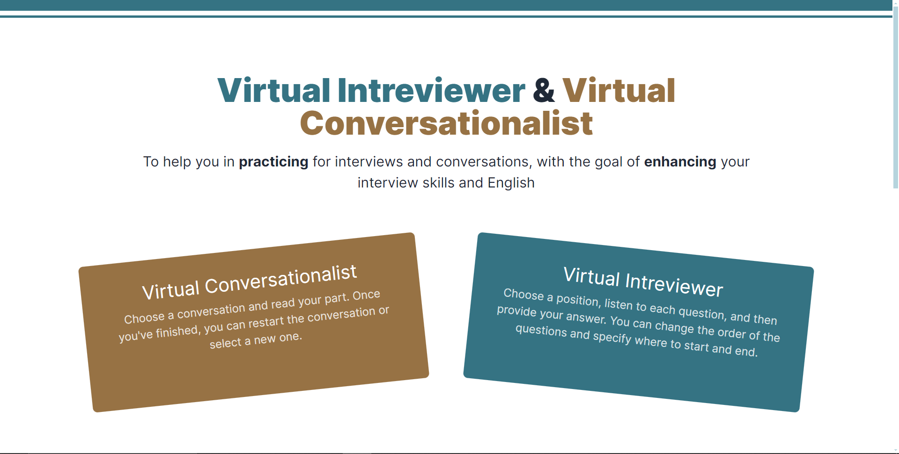
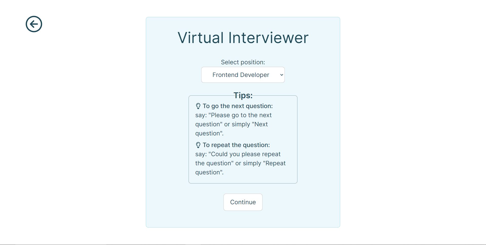
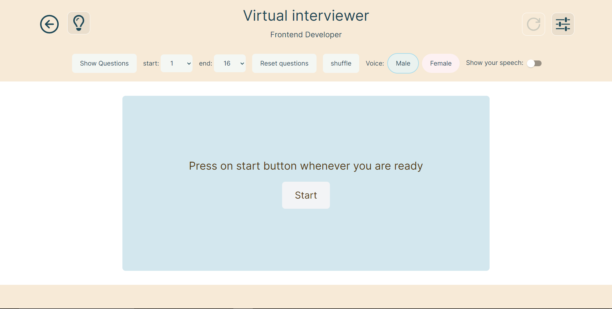
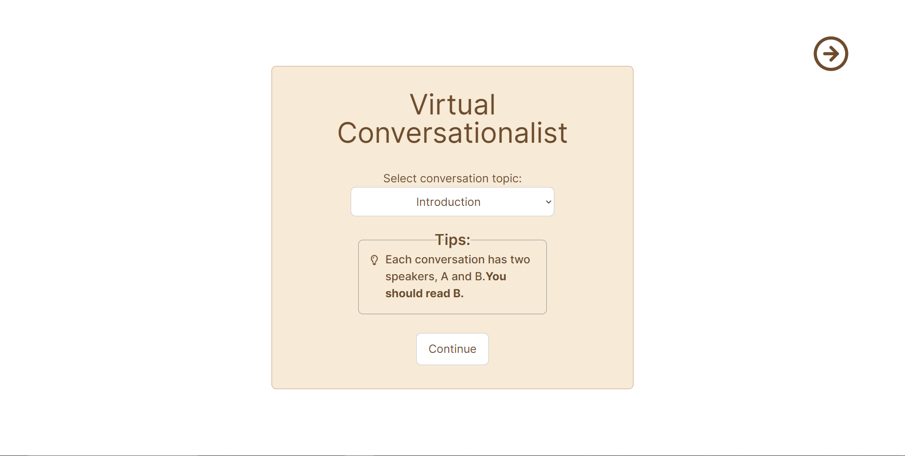
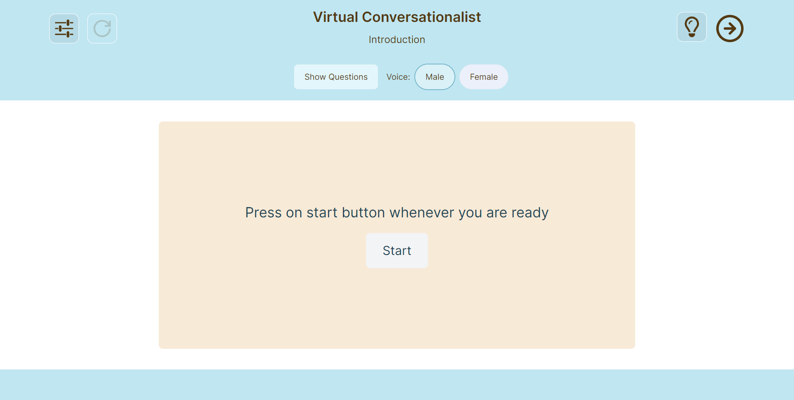

# Virtual Intreviewer & Virtual Conversationalist 1.0.0

###### Note!!!: This web app is still not compatible on all browsers, for now it will only work as expected on Google Chrome and Microsoft Edge.

[Live link]() | [Watch demo]()

A web app to help you Improve your interview skills and English speaking effortlessly with practice sessions tailored for interviews and conversations

# Virtual Intreviewer:
Choose a position, listen to each question, and then provide your answer. You can change the order of the questions and specify where to start and end

### Features:
- multiple positions
- show intreview questions
- choose from where to start
- choose from where to end
- shuffle questions
- reset questions
- change the intreviewer voice (male or female)
- show or hide your answer
- restart the intreview

#### coming Features:
- let the user add their own positions and questions
- design improvements
- use more advanced speech api

# Virtual Conversationalist:
Choose a conversation and read your part. Once you've finished, you can restart the conversation or select a new one

### Features:
- multiple conversation topics
- show the conversation
- change the conversationalist voice (male or female)
- restart the conversation

#### coming Features:
- let the user add their conversation
- design improvements
- use more advanced speech api

## Screenshots

### Desktop

### Mobile
